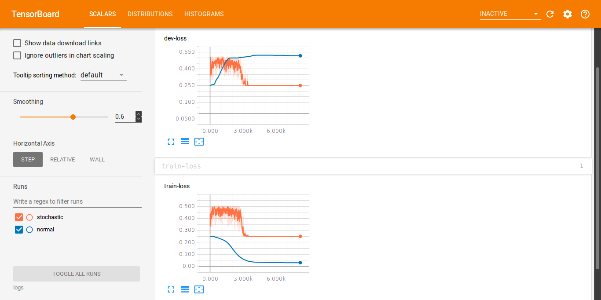

Stochastic Delta Rule
=====

Attempt to reproduce <https://www.sciencedirect.com/science/article/pii/016727899090081Y>

```bash
pipenv install --deploy
pipenv run python sto.py
```

Monitor progress with tensorboard. Sample Experiment produces:


